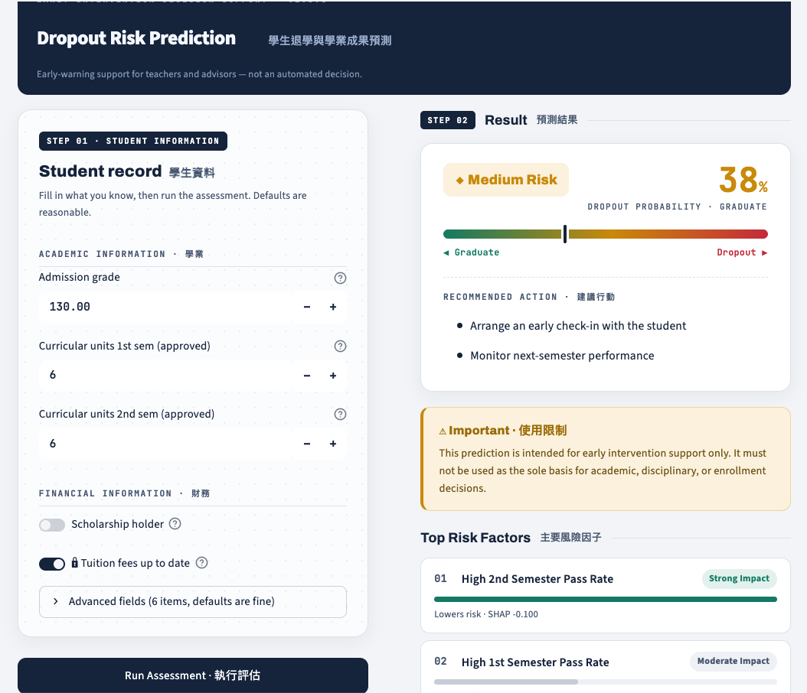

# 學生退學與學業成果預測系統

**A Secure Deep Learning System for Predicting Students' Dropout and Academic Success**

使用學生的入學、課業與背景資料，預測學生的學業結果。建模階段聚焦於最關鍵的
**二分類任務（Dropout 退學 vs Graduate 畢業，已移除 Enrolled 在學樣本）**，
並涵蓋 Explainability、Security、Fairness 與可操作的 Inference 介面。

> **Live Demo**：<https://huggingface.co/spaces/hsuifang/student-dropout-prediction>
>
> 資料集：[UCI – Predict students' dropout and academic success](https://archive.ics.uci.edu/dataset/697/predict+students+dropout+and+academic+success)

---

## 📋 Data Card（組員 A 113AB8049 填寫）

### Data Card（資料卡）

* **資料集名稱（Dataset name）**：
  Predict Students' Dropout and Academic Success

* **資料來源（Dataset source）**：
  UCI Machine Learning Repository（Dataset ID 697）

* **原始資料規模（Original Dataset Size）**：
  * **資料筆數（Instances）**：4,424 位學生
  * **特徵數量（Features）**：36 個原始輸入變數
  * **目標類別（Target Classes）**：3 類（Dropout、Enrolled、Graduate）

* **處理後資料規模（Processed Dataset Size）**：
  * **特徵數量（Features）**：14 個最終模型特徵（含 11 個精選原始特徵與 3 個自創特徵）
  * **目標類別（Target Classes）**：2 類（二元分類：Dropout / Graduate）
  * *註：詳細的資料清洗、特徵篩選與特徵工程實作細節，請參閱 [資料處理說明檔案](./Data_Preprocessing.md)。*

---

* **特徵面向（Feature domains）**：
  原始的 36 個特徵（經優化後為 14 個）主要涵蓋以下面向：
  * 學生人口統計資訊（如：性別、入學年齡、國籍）
  * 學術背景（如：入學成績、前一學歷成績）
  * 家庭與社經背景資訊
  * 學業表現（第一、二學期課程相關資訊）
  * 總體經濟指標（GDP、通貨膨脹率、失業率）

* **目標標籤對照（Target labels comparison）**：
  * **原始標籤（三分類）**：`Dropout`（退學）、`Enrolled`（在學）、`Graduate`（畢業）
  * **處理後標籤（二元分類）**：`1` 代表 Dropout（退學），`0` 代表 Graduate（畢業，已移除 Enrolled 樣本）

---

* **資料前處理與特徵工程概述（Data preprocessing & Feature engineering overview）**：
  為了提高模型精準度並兼顧公平性，我們對原始資料進行了以下優化**（完整技術細節與程式碼請詳見 [01_data_preprocessing.md](./reports/01_data_preprocessing.md)）**：
  1. **資料清洗**：過濾與主要預測目標無關的 `Enrolled`（在學）樣本。
  2. **標籤轉換**：將原始三分類目標轉換為二元分類問題。
  3. **特徵優化**：基於領域知識與統計相關性，將 36 個原始特徵精選並擴充為 14 個核心模型特徵（包含 3 個捕捉學生學習動態的自創特徵）。
  4. **標準化處理**：對數值型特徵進行標準化（Feature Scaling），以利神經網路與線性模型收斂。
  5. **驗證機制**：嚴格切分訓練集與測試集，並採用 5 折分層交叉驗證（5-Fold Stratified Cross-Validation）確保模型泛化能力。

---

* **敏感屬性（Sensitive attributes）**：
  * `Tuition fees up to date`（學費是否按時繳交）

* **隱私風險（Privacy risks）**：
  「學費是否按時繳交」反映學生的財務狀況，屬於敏感個人資訊。雖然資料集中已去識別化（不含姓名、學號），但若與其他人口統計或學業資料結合，仍可能提高推測個人經濟狀況的風險。因此，在資料使用與分享過程中，應採取適當的存取控制與保護措施。

* **偏誤與公平性風險（Bias & Fairness risks）**：
  「學費是否按時繳交」可能間接反映學生的社經地位。若模型過度依賴此特徵，經濟弱勢學生可能被系統性地判定為較高的退學風險。為了修復此偏誤，我們已在專案中引入**公平性修復演算法**。請注意，本模型的預測結果應僅作為學校提供額外支持與介入措施的參考，絕非限制教育機會的工具。

* **預期用途（Intended use）**：
  用於及早識別具有退學風險的學生，以協助學校提供學業輔導、經濟補助及其他針對性的支持措施。

* **禁止用途（Prohibited use）**：
  本模型不得作為以下決策的唯一依據：
  * 學生退學或開除決策
  * 入學資格審核
  * 獎學金分配與紀律處分
  * 任何影響學生權益且未經人工審查的自動化決策

* **資料集限制（Dataset limitations）**：
  1. 資料來自單一高等教育機構，模型結果未必能推廣至其他學校或國家。
  2. 資料反映特定教育制度與社會經濟環境，可能無法完全代表其他學生族群。
  3. 影響退學的重要隱性因素（如心理健康、學習動機、家庭支持度）並未納入資料集中。
  4. 總體經濟變數屬於宏觀指標，無法精確反映個別學生的財務狀況。
  5. 第二學期學業表現相關特徵的存在，可能降低模型在真正早期預警情境中的即時性。
  
---

## 📋 Model Card（組員 B 113AB8046 填寫）

- **Model name**: Fair-Predict Student Retention Model (公平導向型學生退學預警模型)
- **Model version**: `1.0.0` *(已同步更新至 `src/schema.py` 中的 `MODEL_VERSION`)*
- **Model architecture**: 深度前饋神經網路 (Multi-Layer Perceptron, MLP)
  * **Layer Stack**: `Input (14 features) → Dense(64) + BatchNorm + ReLU + Dropout(0.4) → Dense(32) + BatchNorm + ReLU + Dropout(0.3) → Dense(16) + ReLU → Linear(1)`
  * **Loss Function**: `Focal Loss` (處理標籤不平衡) + `MMD MinDiff Loss` (公平性約束)
  * **Optimization**: `Optuna` 自動化貝氏超參數尋優 + `5-Fold` 交叉驗證
- **Training data**: 
  使用經去識別化之校園學生學術與社會經濟特徵數據 (`train_scaled.csv`)。內含 **14 個核心特徵**：包含經 SHAP 篩選之 11 個原始精選特徵，以及本團隊手動創造之 3 個核心特徵（第一、二學期學分通過率、成績變動率），未執行任何破壞資料分佈之 SMOTE 過採樣。

- **Evaluation results**: 
  本專案所有模型均在嚴格的 **5-Fold 交叉驗證** 架構下訓練，並於獨立的黃金測試集（Test Set）進行整合預測（Soft Voting），最終定量評估結果如下：

| Model Stage | Accuracy | Macro F1 | Dropout Recall | ROC-AUC (整合測試集) |
| :--- | :---: | :---: | :---: | :---: |
| **Baseline** (5-Fold 邏輯回歸) | 0.94 | 0.93 | 0.90 | 0.9685 |
| **MLP** (5-Fold) | 0.94 | 0.92 | 0.90 | **0.9730** |
| **MLP + MinDiff** (Optuna調整參數) | 0.92 | 0.91 | 0.90 | 0.9485 |

> 💡 **5-Fold 內部驗證穩定度穩定度**
> * **MLP + MinDiff 內部平均驗證 AUC**: $0.9268 \pm 0.0146$
> * **MLP + MinDiff 內部平均驗證 Gap**: $22.67\% \pm 18.32\%$

- **Fairness results**: 
  本專案選定 `Tuition fees up to date`（學費是否按時繳納）作為受保護之**敏感屬性（Protected Attribute）**。用以衡量模型是否對經濟弱勢學生產生嚴重的系統性歧視。
  
  * **Baseline (FPR Gap)**: **62.54%** 🚨 *(敏感群體 FPR: 66.67% / 對照群體 FPR: 4.13%)*
  * **Pure MLP (FPR Gap)**: **78.52%** 🚨 *(敏感群體 FPR: 83.33% / 對照群體 FPR: 4.82%)*
  * **MLP + MinDiff (FPR Gap)**: 👑 **8.18%** ✨ *(敏感群體 FPR: 16.67% / 對照群體 FPR: 8.49%)*
  
  **去偏誤成效洞察：**  
  透過 Optuna 最大化自訂綜合指標 $\text{Score} = \text{Mean AUC} - \text{Mean FPR Gap}$。實驗證實，最終模型成功**消滅了 86.7% 的歷史財務階層偏見**，且僅犧牲了極微幅（2.39%）的預測上限（AUC）。

- **Intended use**: 
  專門部署於大專院校第一學年結束時之教務數據自動化審查。旨在篩選出具備高退學風險（Dropout）的學生，提供教務處、輔導中心與各班導師作為**「主動發起關懷訪談、心理輔導與全方位校園資源分配」**的早期介入核心依據。

- **Out-of-scope use**: 
  * ❌ **絕對禁止**將本模型之預測標籤或機率，直接用於學生獎學金評定、助學金發放、優良學生選拔之扣分依據。
  * ❌ **絕對禁止**任何校園行政單位在未經人工覆核前，利用此自動化模型直接對學生進行強制退學、留級或任何處罰性之行政決策。

- **Model limitations**: 
  * **時間滯後性**: 核心特徵高度依賴學期末結算之學分與成績，對於學期中途因財務突發危機或志趣不合而「突發性退學」的學生，本模型存在預警延遲。
  * **二元簡化偏誤**: 目前模型將學費繳納狀態簡化為二元（低於中位數 vs 高於中位數），無法精準捕捉更為動態與連續性的家庭財務波動。

- **Ethical risks**: 
  若放任未經 MinDiff 校正的模型（如 Pure MLP）直接上線，模型會產生嚴重的**財務走捷徑（Shortcut Learning）**惡性偏誤。系統將僅憑學生「家庭清寒/學費未按時繳納」此一與學術能力無關的欄位，就給予高達 66.67% 的機率盲目誤判其必定退學，這將導致校園行政資源對特定經濟階層產生結構性歧視與二次標籤化傷害。

- **Security risks**: 見下方 Security 章節
- **Human oversight**: 
  **負責任 AI 核心原則（Human-in-the-loop）**：模型的預測結果與風險機率僅作為校園一線輔導人員的「輔助參考線索」。最終的關懷介入決策、實質因應措施與行政判斷，必須保留 100% 的人工審核與專業導師評估。

- **Deployment status**: 
  * 🟢 **Status**: `Deployed`（已上線）
  * **線上展示**：Hugging Face Spaces — <https://huggingface.co/spaces/hsuifang/student-dropout-prediction>
  * 正式 **5-fold MinDiff ensemble**（`model.pt` + `preprocessor.joblib`）已隨 repo 附上並 Docker 化部署（CPU torch，~1.76GB）；介面與推論層無需改動。
  * 5-Fold 交叉驗證與去偏誤評估通過（整合 FPR Gap < 10%）。

---

## 🔒 Security（組員 C 113AB8050）

重點控制：**Input Validation**、敏感屬性**去識別化**、訓練/推論**共用 preprocessor**（防 training-serving skew）、**Human Review 警告**、去識別化 **inference log**。

> 完整風險登錄（8 項風險 × 說明 × 控制 × 對應實作 × 狀態）與待辦見 [`reports/05_security.md`](reports/05_security.md)。

### 系統警告（顯示於介面）

```
This prediction is intended for early intervention support only.
It must not be used as the sole basis for academic,
disciplinary, or enrollment decisions.
```

## 快速開始 · How to Use

### Step 1 — 安裝環境 (Setup)
```bash
python3 -m venv .venv && source .venv/bin/activate   # 建議使用虛擬環境
pip install -r requirements.txt
```

### Step 2 — 準備模型 (Get a model) — **二選一**
兩種方式都會產出 `models/model.pt` + `models/preprocessor.joblib`，皆符合推論契約、`load_checkpoint` 可直接載入，**介面不需修改**。

```bash
# A) 佔位模型：不需真實資料，最快，先把介面跑起來看 / demo 流程
python -m scripts.train_placeholder

# B) 正式模型：需要真實 data.csv（含 Target 欄；不在 repo 內，請自行放置）
python -m scripts.export_model --data notebooks/data.csv
```

| | A. `train_placeholder` | B. `export_model` |
| --- | --- | --- |
| 資料 | 合成 / UCI（不需 `data.csv`） | 真實 `data.csv` |
| 模型 | 佔位「假模型」，預測無意義 | 正式模型 |
| 方法 | 普通 BCE | Focal + MinDiff，**5-fold soft-voting ensemble**（= 報告中那一顆，方法與組員 B 的 notebook 一致） |
| 用途 | 沒資料也能跑介面 | 正式展示 / 上線 |

> 💡 `export_model` 產出的 5 顆成員以 soft-voting 整合、序列化為單一 `models/model.pt`；
> 推論層 (`src/inference`) 透過 `EnsembleMLP` 自動做機率平均，介面與推論程式皆不需修改。

### Step 3 — 啟動介面 (Run the app)
```bash
streamlit run app/streamlit_app.py     # 開瀏覽器 http://localhost:8501
```
操作：左側填入學生資料 → 按 **Run Assessment** → 右側即時呈現
**風險等級 → 建議行動 → 主要風險因子 → 各類別機率**，並顯示使用限制與人工審核提醒。

<p align="center">
  
</p>

### Step 4 —（選用）產生全域解釋圖
```bash
python -m scripts.plot_global_importance       # → results/global_importance.png
```

> ⚠️ 用 A 跑出來的 `models/model.pt` 為 **placeholder**，僅供串接介面與 demo；
> 正式效能請用 B（或替換成組員 B 訓練好的權重），介面與推論層皆不需更動。

---

## Docker 部署 · Deploy

把介面部署到伺服器，並使用**正式模型（非 placeholder）**：

```bash
# 1) 在有真實 data.csv 的機器上產生正式模型（只有這一步碰原始資料）
python -m scripts.export_model --data notebooks/data.csv
#    → models/model.pt（5-fold ensemble）+ models/preprocessor.joblib

# 2) 建置映像（會把上一步的真實模型一併打包；models/ 若沒有模型則自動燒 placeholder）
docker build -t dropout-app .

# 3) 啟動 / 部署到 server
docker run -d -p 8501:8501 --name dropout dropout-app
#    → http://<伺服器位址>:8501
```

- 映像**不含**原始 / 處理後的學生資料（`data.csv`、`*_scaled.csv` 已由 `.dockerignore` 排除），
  只打包訓練好的 `model.pt` + `preprocessor.joblib`，**行為等同本機跑真實模型**。
- 推論 log 要持久化到主機：加掛 `-v $(pwd)/results:/app/results`。
- 若改了模型，重跑步驟 1 → `docker build` → 重新 `run` 即可。

---

## 推論流程 · Inference Flow

介面（`app/`）不做 ML，只收輸入、串流程、顯示；推論與解釋都委派給 `src/`：

```
填表(11 欄) → ① validate_input → ② predict → ③ explain_record → interpret 翻成人話 → 顯示＋log
              (security)         (inference)   (explain)
```

| 模組 | 職責 |
| --- | --- |
| `inference.py` | **風險多高** — 前處理(11→14)＋模型(DropoutMLP/EnsembleMLP) → 機率 / 風險等級 |
| `explain.py` | **為什麼** — 各特徵推高/降低退學風險的貢獻（SHAP / 梯度後援） |
| `interpret.py`／`security.py` | 數字翻成人話 ／ 輸入驗證＋去識別化 log |

> 💡 介面只依賴 `predict()` / `explain_record()` 兩個介面 → 模型從單顆換成 **5-fold ensemble**，`inference / explain / app` 一行未改。

---

## 專案結構

```
student-dropout-prediction/
├── README.md                # 含 Data Card / Model Card / Security（見下方）
├── requirements.txt
├── src/                     # 共用模組 (模型契約)
│   ├── schema.py            # ★ 唯一真實來源：特徵順序、標籤、敏感屬性、版本
│   ├── model.py             # MLP 定義 + checkpoint 存取格式
│   ├── preprocessing.py     # scaler 建立/載入 (防 training-serving skew)
│   ├── inference.py         # 載入模型 + 預測 + 風險等級
│   ├── explain.py           # SHAP / 梯度後援 (Explainability)
│   ├── interpret.py         # 把模型輸出翻成教師可讀的風險因子 / 建議行動
│   └── security.py          # Input Validation / 去識別化 / Inference Log
├── scripts/
│   ├── train_placeholder.py # 佔位模型 (合成資料, demo 用)
│   ├── export_model.py      # 正式模型 (真實資料, 5-fold MinDiff ensemble)
│   └── plot_global_importance.py # 全域解釋圖 -> results/global_importance.png
├── app/
│   └── streamlit_app.py     # Inference 介面 (組員 C 主要交付)
├── models/                  # model.pt / preprocessor.joblib (生成物)
├── results/                 # 推論紀錄、評估結果
├── notebooks/               # 探索性分析
├── reports/                 # 各階段詳細報告 (前處理/評估/fairness/explainability/security)
└── docs/                    # 作業需求書等參考文件
```

---

## 模型契約（給組員 B 替換真實模型）

只要遵守以下兩點，`models/model.pt` 可直接替換、前端無需改動：

1. **特徵順序與標籤** 來自 `src/schema.py`（`FEATURE_ORDER`、`LABELS`）。
2. **checkpoint 格式** 使用 `src/model.py` 的存檔函式，並一併輸出對應的 `models/preprocessor.joblib`：
   - 單一模型 `save_checkpoint(...)`：
     `state_dict / input_dim / dropout_1 / dropout_2 / num_classes / model_version / label_names`
   - 5-fold ensemble `save_ensemble_checkpoint(...)`：
     `ensemble（各成員 state_dict）/ num_members / input_dim / dropout_1 / dropout_2 / num_classes / model_version / label_names`
   - `load_checkpoint(...)` 會自動辨識上述兩種格式，前端與推論層皆不需更動。

---

## 分工對應

| 模組 | 負責人 | 
| --- | --- |
| 資料前處理、Data Card、Fairness 資料 | 113AB8049 | 
| Baseline、MLP、MinDiff、評估、Model Card | 113AB8046 | 
| Explainability、Security、Inference 介面、Deployment | 113AB8050 |

---

## 詳細報告

以下為重點摘要（Data Card / Model Card / Security）；完整方法與結果見 [`reports/`](reports/README.md)：

| 報告 | 內容 |
| --- | --- |
| [01 前處理](reports/01_data_preprocessing.md) | 資料分析、編碼、切分、Data Leakage |
| [02 模型與評估](reports/02_model_evaluation.md) | Baseline / MLP / MinDiff、指標比較 |
| [03 Fairness](reports/03_fairness.md) | 群體指標、MinDiff 前後比較 |
| [04 Explainability](reports/04_explainability.md) | SHAP 全域 / 局部解釋 |
| [05 Security](reports/05_security.md) | 完整風險登錄與控制細節 |
