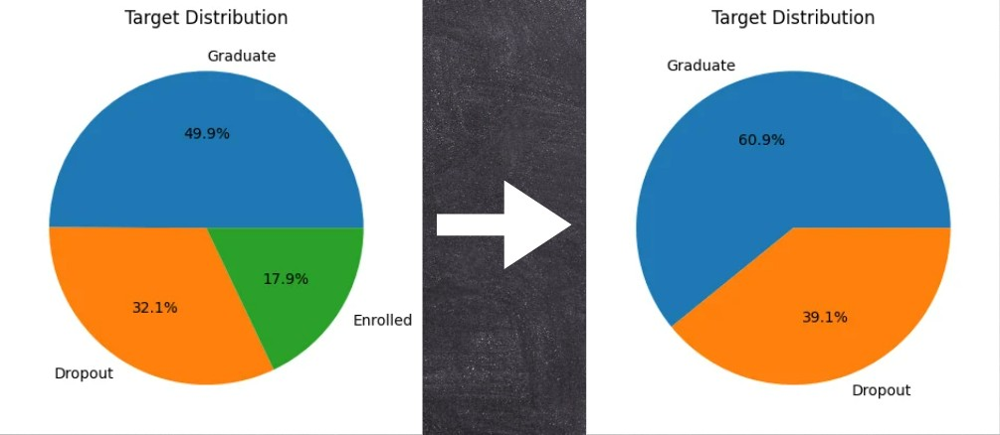
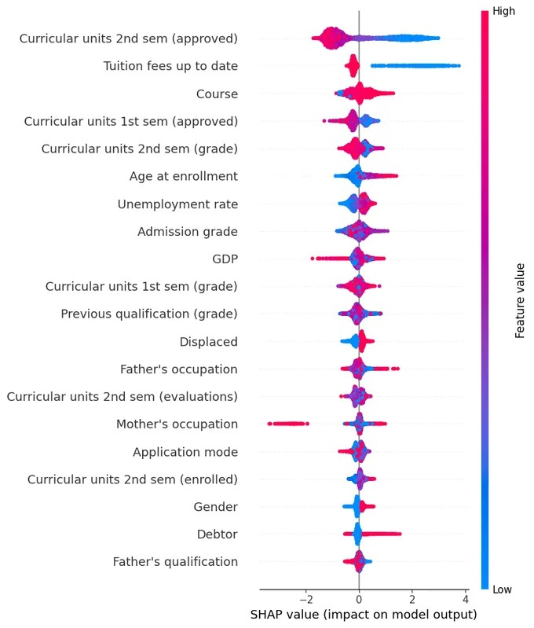

# 01 — 資料分析與前處理（組員 A 113AB8049）

---

## 1. 資料集概覽
- **來源**：UCI Machine Learning Repository (Dataset ID: 697) - "Predict students' dropout and academic success"。
- **總筆數 / 原始欄位數**：原始資料包含 4,424 筆樣本與 37 個欄位（36 個特徵 + 1 個預測標籤 `Target`）。
- **36 個特徵清單與型別**：主要涵蓋：學生個人背景、入學前學業表現、社會經濟因素（如是否按時繳納學費 `Tuition fees up to date`、是否享有獎學金 `Scholarship holder`）及第一、二學期學業表現。
- **預測標籤（Target）**：
  - 原始標籤包含三類：`Dropout`（退學）、`Graduate`（畢業）、`Enrolled`（在讀）。
  - **專業處理決策**：為了聚焦於預測學生是否會走向「退學」的終極命運，本專案在載入資料時**實施了嚴格的資料純淨化，過濾移除處於模糊狀態的 `Enrolled` 樣本**。
  - **二元分類轉換**：將標籤轉換為正負樣本：`Dropout`（退學）為 `1`，`Graduate`（畢業）為 `0`。
  - **過濾後退學比例**：經移除 `Enrolled` 後，純淨訓練集的真實退學率（Base Rate）為 **39.15%**，屬於輕微不平衡資料，後續機器學習流程將透過分層切分與損失函數進行優化。
 

---

## 2. 前處理與特徵篩選步驟

本專案拒絕盲目餵入原始數據，而是規劃了一套**全域篩選 ➔ 可控性收斂 ➔ 特徵升維**的一體化管線。資料流依循：**原始 36 欄 ➔ SHAP 前 20 名 ➔ 人為可干涉 11 欄 ➔ 額外自創 3 欄 ➔ 最終 14 維特徵空間** 進行演進。

### 2.1 機器學習特徵篩選（Feature Selection）
為了建構具備高解釋性且能實質指導學校政策的模型，特徵篩選經歷以下嚴格階段：

1. **階段一（全域 XGBoost 模型訓練）**：將原始的 **36 個特徵** 全部餵進初始分類模型（XGBoost），作為特徵重要性分析的算力底座。
2. **階段二（計算 SHAP 歸因值排名）**：引入 SHAP (SHapley Additive exPlanations) 賽局理論歸因分析，導出前 20 大對模型預測影響力最深遠的特徵排名（Top 20 Features）。由數值排名與密集度分佈圖可觀察到，第二學期通過學分數與學費按時繳納（`Tuition fees up to date`）具備最強烈決策重要性。

3. **階段三（人工精選 11 個可控原始特徵）**：在 SHAP 前 20 名變數中，主動過濾掉無法透過學校政策改變的既定背景事實（如大環境 GDP、失業率、父母職業等），**最終手動精選出 11 個具有「人為或政策干預潛力」（Potential for human or policy intervention）的核心原始特徵**：

| 篩選原始特徵 (Feature) | SHAP 排名 (Rank) | 互資訊得分 (MI) | 政策干預切入點 (Policy Intervention Point) |
| :--- | :--- | :--- | :--- |
| `Curricular units 2nd sem (approved)` | 1 | 0.309975 | 課業預警、第二學期學業輔導 |
| `Curricular units 1st sem (approved)` | 2 | 0.246007 | 寒假銜接補強、適應性輔導 |
| `Tuition fees up to date` | 3 | 0.080529 | 提供分期付款、校內緊急紓困 |
| `Curricular units 1st sem (enrolled)` | 4 | -- | 轉化為第一學期通過率之基底分母 |
| `Curricular units 2nd sem (grade)` | 6 | 0.232004 | 成績滑落變動預警機制 |
| `Scholarship holder` | 7 | 0.049612 | 獎助學金名額優化分配 |
| `Admission grade` | 8 | 0.038124 | 入學成績與在校表現關聯分析 |
| `Curricular units 2nd sem (enrolled)` | 11 | -- | 轉化為第二學期通過率之基底分母 |
| `Previous qualification (grade)` | 15 | 0.043111 | 入學前基礎背景考核 |
| `Application mode` | 19 | 0.049026 | 入學管道適應性追蹤 |
| `Curricular units 1st sem (grade)` | -- | 0.180949 | 成績變動率之基準減項 |

### 2.2 特徵工程設計（Feature Engineering Design）
在確定上述 11 個核心原始特徵後，為了深化模型對「學生學業動態變動」的捕捉，管線（收錄於 [src/preprocessing.py](../src/preprocessing.py)）進一步利用其中的學分註冊與成績欄位，**額外衍生出 3 組強力強力特徵**，使最終餵入模型的特徵空間達到 **14 維**：

| 衍生自創特徵 (Engineered Feature) | 核心含意 (Meaning) | 建構計算方法 (Method) |
| :--- | :--- | :--- |
| `1st_sem_pass_rate` `2nd_sem_pass_rate` | 學期課程通過率 (Course Pass Rate) | $\frac{\text{該學期通過之學分數 (approved)}}{\text{該學期註冊之總學分數 (enrolled)} + 10^{-8}}$ |
| `grade_change` | 學期成績趨勢變動 (Grade Variation) | $\text{第二學期分數 (2nd sem grade)} - \text{第一學期分數 (1st sem grade)}$ |
| `financial_status` | 學生財務綜合狀態 (Financial Status) | $\text{是否為獎學金持有者 (Scholarship holder)} + \text{學費是否按時繳納 (Tuition fees paid)}$ |

### 2.3 資料標準化與嚴格的 Train / Test 切分
- 使用 `sklearn.preprocessing.StandardScaler` 進行 $Z$-Score 標準化（將資料平移至均值 $\mu=0$，標準差 $\sigma=1$）。
- 轉換後保留 DataFrame 的欄位名稱（Column Names），以利後續階段進行 MinDiff 敏感欄位對齊與公平性審計。

---

## 3. 資料品質檢查與敘述統計（Descriptive Statistics）
經對原始 4,424 筆資料進行檢查與敘述統計分析，特徵的分佈表現如下：

### 整合敘述統計表 (Descriptive Statistics Matrix)

| Feature (特徵欄位) | count | mean | std | min | 25% | 50% | 75% | max |
| :--- | :---: | :---: | :---: | :---: | :---: | :---: | :---: | :---: |
| **Previous qualification (grade)** | 4424 | 132.6133137 | 13.18833169 | 95 | 125 | 133.1 | 140 | 190 |
| **Mother's qualification** | 4424 | 19.56193 | 15.60319 | 1 | 2 | 19 | 37 | 44 |
| **Admission grade** | 4424 | 126.9781193 | 14.48200082 | 95 | 117.9 | 126.1 | 134.8 | 190 |
| **Age at enrollment** | 4424 | 23.26514467 | 7.587815615 | 17 | 19 | 20 | 25 | 70 |
| **Curricular units 1st sem (credited)** | 4424 | 0.709990958 | 2.360506619 | 0 | 0 | 0 | 0 | 20 |
| **Curricular units 1st sem (enrolled)** | 4424 | 6.27057 | 2.480178 | 0 | 5 | 6 | 7 | 26 |
| **Curricular units 1st sem (evaluations)** | 4424 | 8.299051 | 4.179106 | 0 | 6 | 8 | 10 | 45 |
| **Curricular units 1st sem (approved)** | 4424 | 4.7066 | 3.094238 | 0 | 3 | 5 | 6 | 26 |
| **Curricular units 1st sem (grade)** | 4424 | 10.64082 | 4.843663 | 0 | 11 | 12.28571 | 13.4 | 18.875 |
| **Curricular units 1st sem (without evaluations)** | 4424 | 0.137658 | 0.69088 | 0 | 0 | 0 | 0 | 12 |
| **Curricular units 2nd sem (credited)** | 4424 | 0.541817 | 1.918546 | 0 | 0 | 0 | 0 | 19 |
| **Curricular units 2nd sem (enrolled)** | 4424 | 6.232143 | 2.195951 | 0 | 5 | 6 | 7 | 23 |
| **Curricular units 2nd sem (evaluations)** | 4424 | 8.063291 | 3.947951 | 0 | 6 | 8 | 10 | 33 |
| **Curricular units 2nd sem (approved)** | 4424 | 4.435805 | 3.014764 | 0 | 2 | 5 | 6 | 20 |
| **Curricular units 2nd sem (grade)** | 4424 | 10.23021 | 5.210808 | 0 | 10.75 | 12.2 | 13.33333 | 18.57143 |
| **Curricular units 2nd sem (without evaluations)** | 4424 | 0.150316456 | 0.753774069 | 0 | 0 | 0 | 0 | 12 |
| **Unemployment rate** | 4424 | 11.56614 | 2.66385 | 7.6 | 9.4 | 11.1 | 13.9 | 16.2 |
| **Inflation rate** | 4424 | 1.228028933 | 1.382710692 | -0.8 | 0.3 | 1.4 | 2.6 | 3.7 |
| **GDP** | 4424 | 0.001969 | 2.269935 | -4.06 | -1.7 | 0.32 | 1.79 | 3.51 |

### 特徵分佈詳細說明

- **缺失值與重複值**：全欄位無缺失值（Count 皆為 4,424），且無重複學生紀錄。
- **入學特徵分佈**：
  - `Age at enrollment`（入學年齡）：平均值為 **23.27 歲**，標準差 **7.59**。最小年齡為 **17 歲**，但最大年齡達 **70 歲**（第 75 百分位數為 25 歲），顯示存在高齡在職進修之極端值。
  - `Admission grade`（入學成績）：平均值為 **126.98 分**，分佈介於 **95 分至 190 分**之間。
- **學期修課表現（第一、二學期對比異常值檢查）**：
  - `Curricular units 1st sem (approved)`（第一學期通過學分數）：平均通過 **4.71 門**，最高達 **26 門**。
  - `Curricular units 2nd sem (approved)`（第二學期通過學分數）：平均通過 **4.44 門**，最高達 **20 門**。
  - 成績部分，第一學期平均成績為 **10.64 分**，第二學期平均成績為 **10.23 分**。在修課通過率計算中，由於部分學生註冊學分數為 0（Min 分佈為 0），存在分母為零之風險，已於特徵工程進行處理。
- **總體經濟與外部環境特徵**：
  - `Unemployment rate`（失業率）：平均高達 **11.57%**（區間 7.6% - 16.2%）。
  - `Inflation rate`（通貨膨脹率）：平均為 **1.23%**。
  - `GDP`（國內生產總值變動率）：平均接近於零（**0.002**），最低曾跌至 **-4.06%**，反映出外部經濟波動對學生就學穩定度之潛在衝擊。

---

## 4. Data Leakage（資訊洩漏）嚴格檢查
資料洩漏是機器學習專案失效的首要原因。本專案進行了最高規格的防禦：

- **標準化洩漏防禦（關鍵步驟）**：
  - **【鐵律】**：`StandardScaler` **只在訓練集 (`X_train`) 上進行 `fit_transform`**，計算出訓練集的均值與標準差。
  - **【鐵律】**：測試集 (`X_test`) **絕對只能進行 `transform`**。測試集偷偷借用訓練集的統計量，嚴格禁止參與 `fit` 過程。
- **未來特徵審查**：第二學期的學業表現特徵（如 `Curricular units 2nd sem` 系列）在學期末是已知數據，若用於預測「該學期中途退學」可能存在時序上的洩漏。但由於目標標籤定義為「最終是否成功畢業或退學」，在全學程回溯性分析中屬於合規特徵。

---

## 5. 敏感屬性與公平性基礎定義
為響應需求書對於模型公平性（Fairness）的嚴格要求，在前處理階段確立了關鍵的社會經濟敏感屬性：

- **核心敏感特徵**：`Tuition fees up to date`（學費是否按時繳納）。
- **基準值（Median）界定**：在訓練集上計算該欄位的中央基準值（Median），以此作為切分弱勢群體與對照群體的指標。
- **群體劃分邏輯**：
  - **敏感群體（Sens Group）**：標準化後的學費特徵值 < 訓練集基準值。代表「**未能按時繳納學費的經濟弱勢學生**」。
  - **對照群體（Ref Group）**：標準化後的學費特徵值 $\ge$ 訓練集基準值。代表「**有按時繳納學費的學生**」。
- **前處理產出承接**：此劃分矩陣與標準化特徵將直接落盤儲存，承接給後續的邏輯斯迴歸（Baseline）、深度神經網路（MLP）以及終極的 **MinDiff 仿射對齊公平性修復演算法**，用於追蹤與消除兩組之間的偽陽性率差距（FPR Gap）。
