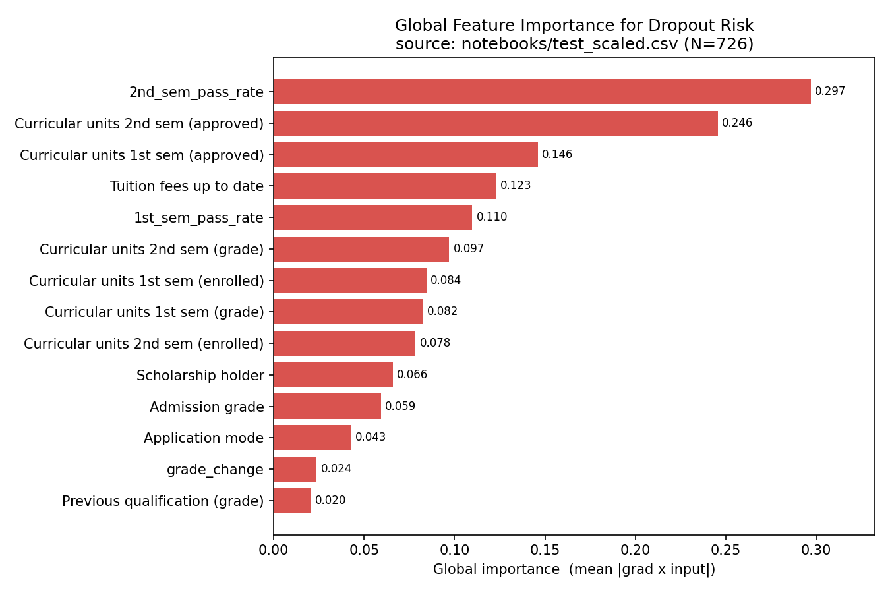

# 04 — Explainability（組員 C）

對應需求書第 7 節。實作於 `src/explain.py`，呈現於 `app/streamlit_app.py`。

> 任務為**二分類**（Graduate vs Dropout，單一 logit）。模型只輸出一個退學 logit，
> 因此所有解釋的對象固定為「**退學風險（Dropout）**」：contribution > 0 表示推高退學
> 機率、< 0 表示降低。

## 1. 方法
- 主要：**SHAP**（`GradientExplainer`，適用 PyTorch MLP）。
- 後援：環境未安裝 SHAP 時，自動退回 **Gradient × Input** 近似，確保介面仍可 demo。
- 程式入口：
  - Local：`explain_record(record, top_k)` → 單筆預測的特徵貢獻。
  - Global：`global_importance(X_scaled, top_k)` → 一批資料上的整體特徵重要度。

## 2. Global Explanation（全域）— ✅ 已實作
- 目的：哪些特徵對「退學風險」整體影響最大。
- 做法：對每筆樣本計算退學 logit 對輸入的梯度 × 輸入值，取**絕對值的平均**
  （mean |grad × input|）作為各特徵全域重要度，再由大到小排序。
- 程式：`src.explain.global_importance(X_scaled, top_k)`；`X_scaled` 為已標準化的
  14 維矩陣（欄位順序 = `schema.FEATURE_ORDER`），可直接讀入訓練程式產出的
  `test_scaled.csv`（去掉 `Target_Label` 欄）。
- 用法範例：
  ```python
  import pandas as pd
  from src.explain import global_importance
  X = pd.read_csv("test_scaled.csv").drop(columns=["Target_Label"]).values
  g = global_importance(X, top_k=8)
  for name, imp in g["importances"]:
      print(f"{name:38s} {imp:.4f}")
  ```
- 全域重要度長條圖（以獨立測試集 `test_scaled.csv`，N=726 聚合）：

  

  產圖指令：
  ```bash
  python -m scripts.plot_global_importance            # 預設讀 notebooks/test_scaled.csv → results/global_importance.png
  python -m scripts.plot_global_importance --top 8    # 只畫前 8 名
  ```
- 觀察：高重要度特徵集中於 **第二學期通過率 / 通過科目數、第一學期通過科目數、
  `Tuition fees up to date`、入學成績** —— 與「課業表現 + 財務狀態」主導退學風險的直覺一致。
  其中 `Tuition fees up to date` 名列前茅，正是我們選它作為**敏感屬性**並施加 MinDiff 去偏誤的原因。
- summary plot（選用）：安裝 SHAP 後可另外輸出 `shap.summary_plot` 作為補充。

> ⚠️ 上圖反映「目前 `models/model.pt`」之行為。換上正式 MinDiff 模型（notebook Cell 4）後，
> 重新執行上述指令即可更新為正式結果。

## 3. Local Explanation（局部）— ✅ 已實作
- 目的：單一學生為何被預測為高/低退學風險。
- 做法：對該筆輸入計算各特徵 signed contribution（SHAP，或梯度後援）。
  - contribution > 0 → 推高退學機率
  - contribution < 0 → 降低退學機率
- 介面顯示 top-k 特徵與方向（🔺推高 / 🔻降低），見 `app/streamlit_app.py`。

## 4. 介面呈現範例
```
Predicted Outcome: Dropout   (Dropout Probability: 78%)
影響「退學風險」的主要特徵：
- 🔻 Tuition fees up to date        （學費已繳，降低退學風險）
- 🔺 2nd_sem_pass_rate              （第二學期通過率偏低，推高退學風險）
- 🔺 Curricular units 2nd sem (approved)
```

## 5. 限制
> SHAP / 梯度顯示的是模型判斷依據，**不代表真正的因果關係**；解釋僅供人工審核參考。
> Global 的梯度近似為一階靈敏度，與完整 SHAP 值在數量級上會有差異，僅用於相對排序。
